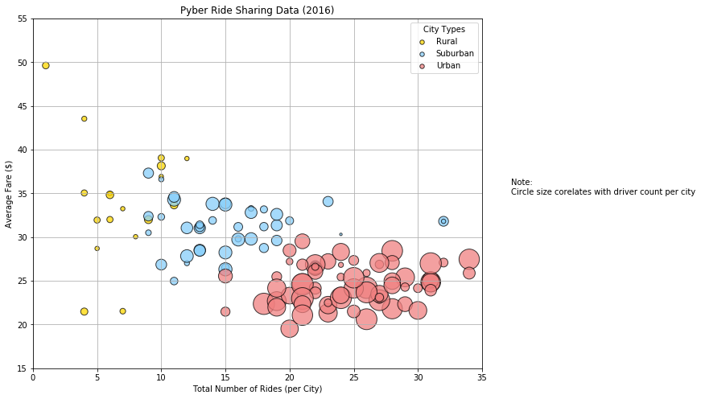
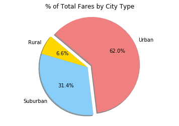
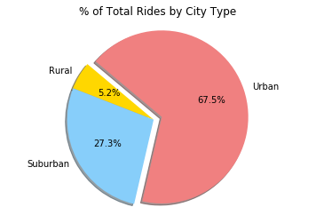
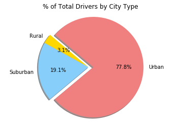

# The Power of Plots
Homework Week 5 - Pyber

This assignment uses python matplotlib to create a bubble plot that showcases the relationship between four key variables. and pie charts to show percentage distribution by type of three variables.

* Observations
    * As city size increases the number of rides and drivers increase while the average fare per ride decreases.
    * Average fare for urban and suburban are tightly clustered within the group; however there is wide variance in the average fare of Rural
    * The percent of rides is proportional to the percent of fares, but the percent of drivers is not proportional to percent of fares.
    * The city of Manuelchester warrants further investigation of the integrity of the data


## Python Plots Markdown

```python
# Import Dependencies
import pandas as pd
import numpy as np
import matplotlib.pyplot as plt
```


```python
# Set filepaths
csv_filepath1 = "raw_data/city_data.csv"
csv_filepath2 = "raw_data/ride_data.csv"
```


```python
# Read the csv files into new dataframes
city_df = pd.read_csv(csv_filepath1, encoding="iso-8859-1", low_memory=False)
ride_df = pd.read_csv(csv_filepath2, encoding="iso-8859-1", low_memory=False)
```


```python
# Inspect the files
    # city_df.head()
    #ride_df.head()
```


```python
# Group ride data by City
groupedRide = ride_df.groupby(["city"], as_index=False)
    #groupedRide.head()
```


```python
# Get the number of rides per city
numRides = groupedRide["ride_id"].count()
    #numRides.head()
```


```python
# Get the average fare per city
avgFare = groupedRide["fare"].mean()
    #avgFare.head()
```


```python
# Get the total fares by city
totFare = groupedRide["fare"].sum()
    #totFare.head()
```


```python
# Merge city data with grouped ride data
rideByCity = pd.merge(city_df, numRides, on="city")
rideByCity = pd.merge(rideByCity, avgFare, on="city")
rideByCity = pd.merge(rideByCity, totFare, on="city")
    #rideByCity.head()
```


```python
# Rename columns
rideByCity.columns = ["city", "driver_count", "type", "num_rides", "avg_fare", "tot_fare"]
rideByCity.head()
```


## Summary of Ride Data by City
<div>

<table border="1" class="dataframe">
  <thead>
    <tr style="text-align: right;">
      <th></th>
      <th>city</th>
      <th>driver_count</th>
      <th>type</th>
      <th>num_rides</th>
      <th>avg_fare</th>
      <th>tot_fare</th>
    </tr>
  </thead>
  <tbody>
    <tr>
      <th>0</th>
      <td>Kelseyland</td>
      <td>63</td>
      <td>Urban</td>
      <td>28</td>
      <td>21.806429</td>
      <td>610.58</td>
    </tr>
    <tr>
      <th>1</th>
      <td>Nguyenbury</td>
      <td>8</td>
      <td>Urban</td>
      <td>26</td>
      <td>25.899615</td>
      <td>673.39</td>
    </tr>
    <tr>
      <th>2</th>
      <td>East Douglas</td>
      <td>12</td>
      <td>Urban</td>
      <td>22</td>
      <td>26.169091</td>
      <td>575.72</td>
    </tr>
    <tr>
      <th>3</th>
      <td>West Dawnfurt</td>
      <td>34</td>
      <td>Urban</td>
      <td>29</td>
      <td>22.330345</td>
      <td>647.58</td>
    </tr>
    <tr>
      <th>4</th>
      <td>Rodriguezburgh</td>
      <td>52</td>
      <td>Urban</td>
      <td>23</td>
      <td>21.332609</td>
      <td>490.65</td>
    </tr>
  </tbody>
</table>
</div>


```python
# Create charting data frames for each type
rural_df = rideByCity[rideByCity["type"]=="Rural"]
suburban_df = rideByCity[rideByCity["type"]=="Suburban"]
urban_df = rideByCity[rideByCity["type"]=="Urban"]
    #urban_df.head()
```


```python
# Set Plot figure size
plt.figure(figsize=(10,8))
plt.figtext(.95, .5, "Note: \nCircle size corelates with driver count per city")
```


    <matplotlib.text.Text at 0x1e0346a5278>


```python
# Plot by type
plt.scatter(rural_df["num_rides"], rural_df["avg_fare"], marker="o", facecolors="gold", edgecolors="black", label="Rural", s=rural_df["driver_count"]*10, alpha=0.75)
plt.scatter(suburban_df["num_rides"], suburban_df["avg_fare"], marker="o", facecolors="lightskyblue", edgecolors="black", label="Suburban", s=suburban_df["driver_count"]*10, alpha=0.75)
plt.scatter(urban_df["num_rides"], urban_df["avg_fare"], marker="o", facecolors="lightcoral", edgecolors="black", label="Urban", s=urban_df["driver_count"]*10, alpha=0.75)
```


    <matplotlib.collections.PathCollection at 0x1e0347e8ef0>


```python
# Add labels to the x and y axes
plt.title("Pyber Ride Sharing Data (2016)")
plt.xlabel("Total Number of Rides (per City)")
plt.ylabel("Average Fare ($)")
```


    <matplotlib.text.Text at 0x1e03478f9e8>


```python
# Set your x and y limits
plt.xlim(0, 35)
plt.ylim(15, 55)
```


    (15, 55)


```python
# Set a grid on plot and format legend
plt.grid()
lgnd= plt.legend(loc="upper right", scatterpoints=1, fontsize=10, title="City Types")
lgnd.legendHandles[0]._sizes = [30]
lgnd.legendHandles[1]._sizes = [30]
lgnd.legendHandles[2]._sizes = [30]
```

## Bubble Plot of Ride Sharing Data
```python
# Save and show plot
plt.savefig("RideShareByCity.png")
plt.show()
```





```python
# Group rideByCity data by type
groupedType = rideByCity.groupby(["type"], as_index=False)
    #groupedType.head()
```


```python
# Get number of rides by type
typeNumRides = pd.DataFrame(groupedType["num_rides"].sum())
    #typeNumRides.head()
```


```python
# Get total fare by type
typeTotFare = pd.DataFrame(groupedType["tot_fare"].sum())
    #typeTotFare.head()
```


```python
# Get number of drivers by type
typeTotDrivers = pd.DataFrame(groupedType["driver_count"].sum())
    #typeTotDrivers.head()
```


```python
# Merge to a ride by type summary table
rideByType = pd.merge(typeNumRides, typeTotFare, on="type")
rideByType = pd.merge(rideByType,typeTotDrivers )
    #rideByType.head()
```


```python
# Get total num rides, drivers and fare
totalRides = rideByType["num_rides"].sum()
totalFare = rideByType["tot_fare"].sum()
totalDrivers = rideByType["driver_count"].sum()
    #print(f"Total rides: {totalRides} fare: {totalFare} drivers:{totalDrivers}")
```


```python
# Add calalated percent columns to the summary table
rideByType["avg_fare"] = rideByType["tot_fare"]/rideByType["num_rides"]
rideByType["pct_rides"] = rideByType["num_rides"]/totalRides
rideByType["pct_fares"] = rideByType["tot_fare"]/totalFare
rideByType["pct_drivers"] = rideByType["driver_count"]/totalDrivers
rideByType.head()
```


## Summary of Ride Data by City Type
<div>

<table border="1" class="dataframe">
  <thead>
    <tr style="text-align: right;">
      <th></th>
      <th>type</th>
      <th>num_rides</th>
      <th>tot_fare</th>
      <th>driver_count</th>
      <th>avg_fare</th>
      <th>pct_rides</th>
      <th>pct_fares</th>
      <th>pct_drivers</th>
    </tr>
  </thead>
  <tbody>
    <tr>
      <th>0</th>
      <td>Rural</td>
      <td>125</td>
      <td>4255.09</td>
      <td>104</td>
      <td>34.040720</td>
      <td>0.051932</td>
      <td>0.065798</td>
      <td>0.031054</td>
    </tr>
    <tr>
      <th>1</th>
      <td>Suburban</td>
      <td>657</td>
      <td>20335.69</td>
      <td>638</td>
      <td>30.952344</td>
      <td>0.272954</td>
      <td>0.314458</td>
      <td>0.190505</td>
    </tr>
    <tr>
      <th>2</th>
      <td>Urban</td>
      <td>1625</td>
      <td>40078.34</td>
      <td>2607</td>
      <td>24.663594</td>
      <td>0.675114</td>
      <td>0.619745</td>
      <td>0.778441</td>
    </tr>
  </tbody>
</table>
</div>


```python
# Create series for pie charts
pie_fares = rideByType["pct_fares"]
pie_rides = rideByType["pct_rides"]
pie_drivers = rideByType["pct_drivers"]
```


```python
# Set global pie chart varibles
labels = ["Rural", "Suburban", "Urban"]
colors = ["gold", "lightskyblue", "lightcoral"]
explode = (0, 0, 0.1)
```

## Pie Charts of Ride Data by City Type

```python
# Plot pie chart of Pct Fares
plt.pie(pie_fares, labels=labels, explode=explode, colors=colors, autopct="%1.1f%%", shadow=True, startangle=140)
plt.axis("equal")
plt.title("% of Total Fares by City Type")
```


    <matplotlib.text.Text at 0x1e034bcbb00>


```python
# Show the plot
plt.savefig("PctFaresByType.png")
plt.show()
```





```python
# Plot pie chart of Pct Rides
plt.pie(pie_rides, labels=labels, explode=explode, colors=colors, autopct="%1.1f%%", shadow=True, startangle=140)
plt.axis("equal")
plt.title("% of Total Rides by City Type")
plt.savefig("PctRidesByType.png")
plt.show()
```





```python
# Plot pie chart of Pct Drivers
plt.pie(pie_drivers, labels=labels, explode=explode, colors=colors, autopct="%1.1f%%", shadow=True, startangle=140)
plt.axis("equal")
plt.title("% of Total Drivers by City Type")
plt.savefig("PctDriversByType.png")
plt.show()
```




